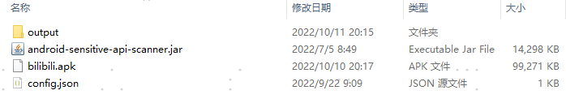

# android-sensitive-api-scanner

这是一个命令行工具，用于针对 apk 文件进行静态扫描方法引用链。配置想要被扫描的方法请见[这里](https://github.com/porum/android-sensitive-api-scanner/blob/master/scanner/src/test/resources/sensitive-api.json)。类图的构建基于 [jadx](https://github.com/skylot/jadx) 。

## Usage
```
java -jar asas.jar [options] <input files> (.apk)
options:
  -json                               - sensitive api config
  -mapping                            - mapping file
  -d, --output-dir                    - output directory

Examples:
  java -jar asas.jar -json sensitive-api-config.json -mapping mapping.txt -d out sample.apk
```

## Example

比如我们要扫描哔哩哔哩的 apk，配置好想要扫描的方法配置文件 config.json，新建扫描结果输出目录 output：



在命令行输入：

```shell
java -jar android-sensitive-api-scanner.jar -json config.json -d output bilibi.apk
```

稍等片刻（p.s. 扫描时间的快慢取决于被扫描的 apk 的工程代码量）后，即可生成输出结果，内容形如：

```
com.bilibili.biligame.api.interceptor.b.(Ljava/util/Map;)V
   com.bilibili.biligame.track.utils.a.()Ljava/util/Map;
      com.bilibili.biligame.track.utils.a.()Ljava/lang/String;
         com.bilibili.droid.PhoneUtils.(Landroid/content/Context;)Ljava/lang/String;
            com.bilibili.droid.PhoneUtils.(Landroid/content/Context;Z)Ljava/lang/String;
               com.bilibili.privacy.Privacy.(Landroid/telephony/TelephonyManager;I)Ljava/lang/String;
                  android.telephony.TelephonyManager.getImei(I)Ljava/lang/String;
```

这里只是拿第三方的 apk 举例，如果想扫描自己工程的 apk，可以指定 mapping 文件，这样扫描出来的结果就是反混淆后的原始代码。